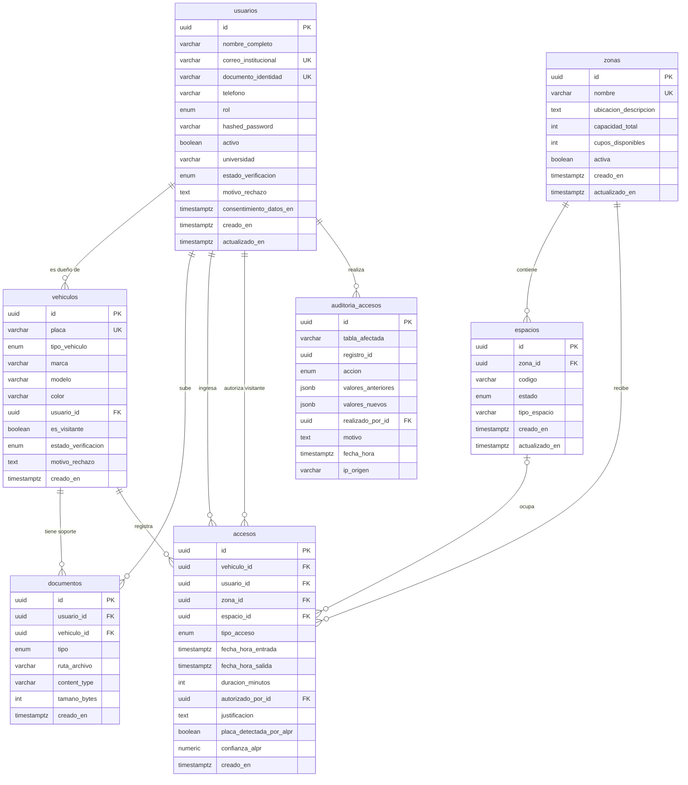

# Diagrama entidad-relación

Se visualiza directamente en GitHub (Mermaid). Para exportarlo a PostgreSQL, MySQL u otro motor, usa [`diagrama-er.dbml`](diagrama-er.dbml) en <https://dbdiagram.io/d>.

