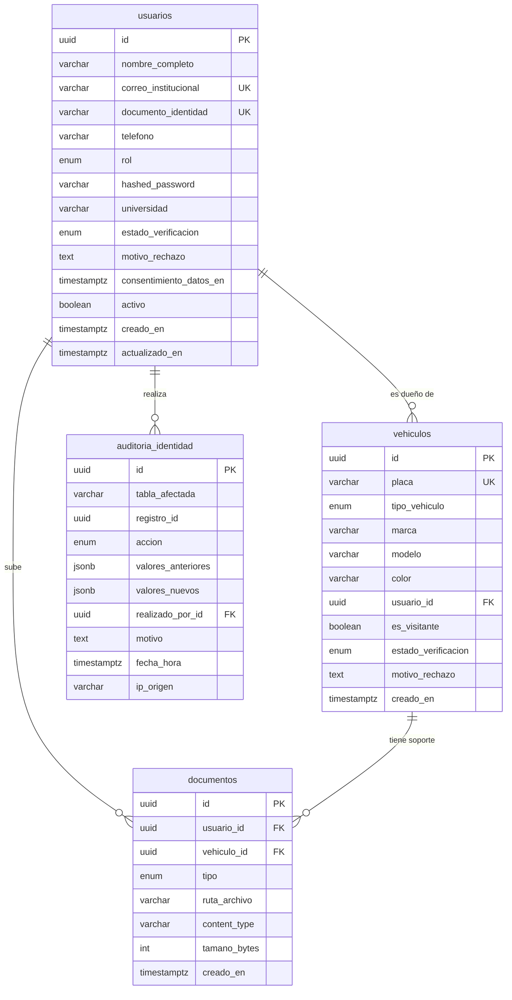
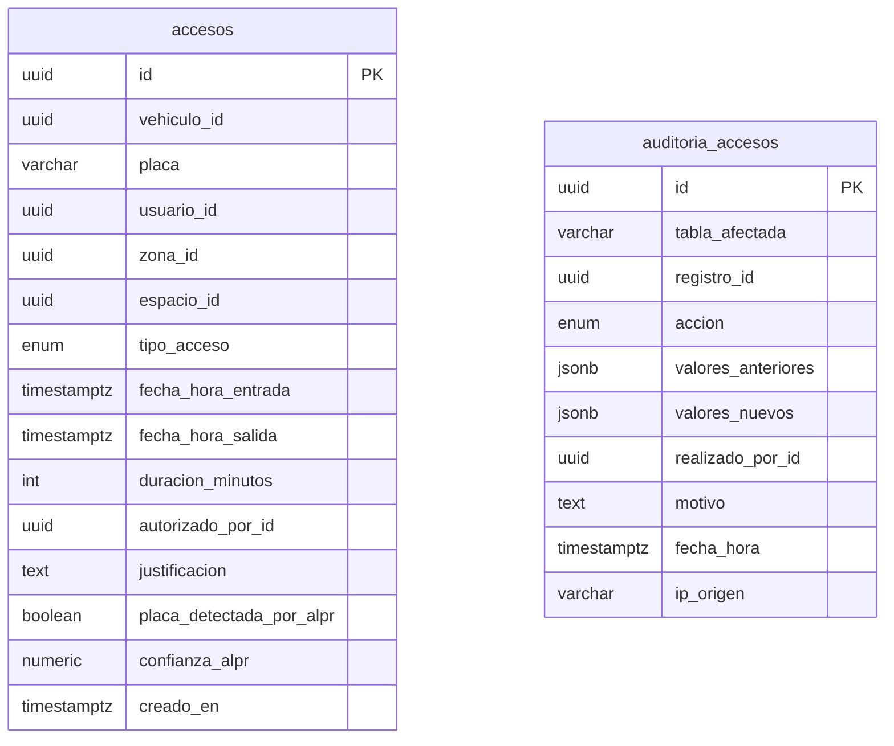
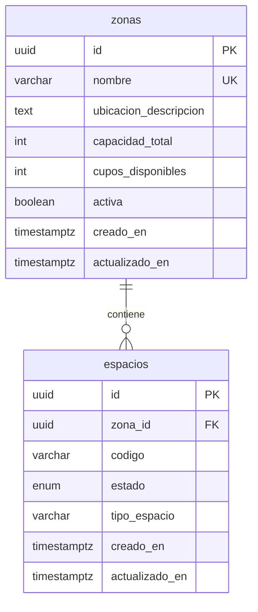

# Diagrama entidad-relación

Hay una base de datos por microservicio, así que hay un diagrama por base. Entre bases no hay llaves foráneas: lo que una guarda de otra es solo un identificador, y la consistencia la cuida el código (ver [`docs/arquitectura.md`](../docs/arquitectura.md)).

Se visualiza directamente en GitHub (Mermaid). Para exportarlo a PostgreSQL, MySQL u otro motor, usa [`diagrama-er.dbml`](diagrama-er.dbml) en <https://dbdiagram.io/d>.

## Identidad — base `parqueadero_identidad`

## Accesos — base `parqueadero`

Las dos tablas no tienen llaves foráneas: `vehiculo_id`, `usuario_id`, `autorizado_por_id` y `realizado_por_id` son identificadores de la base de identidad, y `zona_id` y `espacio_id`, de la de parqueadero.

## Parqueadero — base `parqueadero_zonas`

## Referencias entre bases (sin llave foránea)

| Columna | Apunta a | Base de destino |
|---|---|---|
| `accesos.vehiculo_id` | `vehiculos.id` | `parqueadero_identidad` |
| `accesos.usuario_id` | `usuarios.id` | `parqueadero_identidad` |
| `accesos.autorizado_por_id` | `usuarios.id` | `parqueadero_identidad` |
| `auditoria_accesos.realizado_por_id` | `usuarios.id` | `parqueadero_identidad` |
| `accesos.zona_id` | `zonas.id` | `parqueadero_zonas` |
| `accesos.espacio_id` | `espacios.id` | `parqueadero_zonas` |
