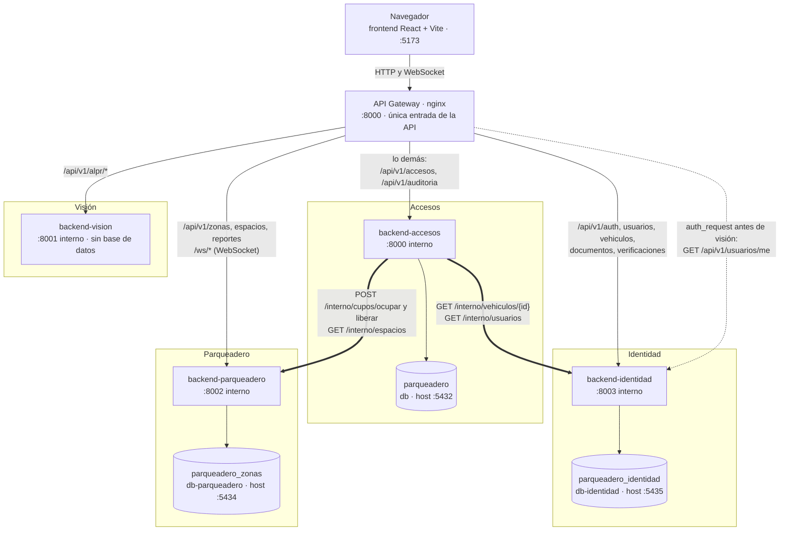

# Arquitectura de microservicios

El navegador solo conoce una dirección: el **API Gateway** (nginx, puerto 8000), que reparte cada
ruta al microservicio que le corresponde. Detrás hay cuatro servicios; tres tienen su propia base
de datos y Visión no guarda nada. Ningún servicio lee las tablas de otro: Accesos le pregunta a
Identidad por el vehículo y los usuarios, y a Parqueadero le pide ocupar o liberar el cupo, siempre
por la API `/interno`, que el gateway no publica. Antes de dejar pasar una foto a Visión, el
gateway comprueba la sesión contra Identidad (línea punteada).

- Flecha fina: lo que reparte el gateway. Flecha gruesa: llamadas entre servicios por `/interno`.
- Los puertos de las bases son los que se publican en el equipo anfitrión por defecto; se cambian
  en `.env` (`POSTGRES_PORT`, `PARQUEADERO_DB_PORT`, `IDENTIDAD_DB_PORT`). Dentro de la red de
  Docker las tres escuchan en el 5432.
- Accesos y Parqueadero no consultan a Identidad para autorizar: validan la firma del token.

Verificado contra: `gateway/nginx.conf.template`, `docker-compose.yml`, los routers de cada
servicio y `backend-accesos/app/{identidad_client,parqueadero_client}/client.py`.
