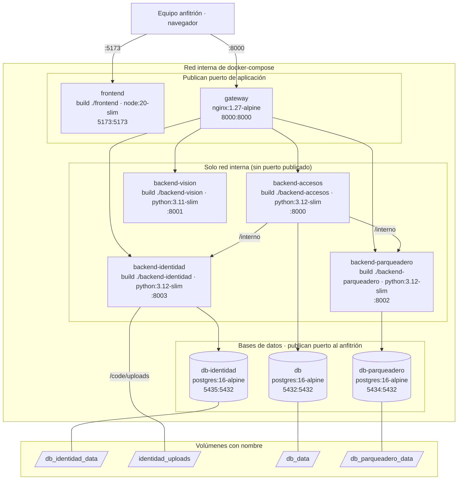

# Despliegue

Todo corre con `docker compose`: nueve contenedores en una misma red interna. Solo el `frontend`
(5173) y el `gateway` (8000) publican puerto de aplicación; los cuatro backends no publican
ninguno y solo se alcanzan por el gateway o entre ellos. Cada servicio con datos tiene su propio
contenedor de PostgreSQL 16 (`postgres:16-alpine`) y su propio volumen, de modo que si una base se
cae las otras siguen arriba. Los documentos de verificación viven en un volumen aparte
(`identidad_uploads`), nunca como archivos estáticos.

- Los puertos se leen `anfitrión:contenedor` y son los valores por defecto del compose; se cambian
  en `.env` (`GATEWAY_PORT`, `FRONTEND_PORT`, `POSTGRES_PORT`, `PARQUEADERO_DB_PORT`,
  `IDENTIDAD_DB_PORT`).
- Las bases publican puerto al anfitrión para desarrollo; cerrarlos es parte del paso 7.
- No se dibujan los montajes de desarrollo: el código de identidad, accesos y parqueadero en
  `/code`, el del frontend en `/app` (con `node_modules` en un volumen anónimo) y la plantilla
  `gateway/nginx.conf.template` en solo lectura.
- Orden de arranque (`depends_on`): cada backend espera a que su base esté sana; accesos espera
  además a identidad y parqueadero; el gateway, a los cuatro backends.

Verificado contra: `docker-compose.yml` y el `Dockerfile` de cada servicio.
