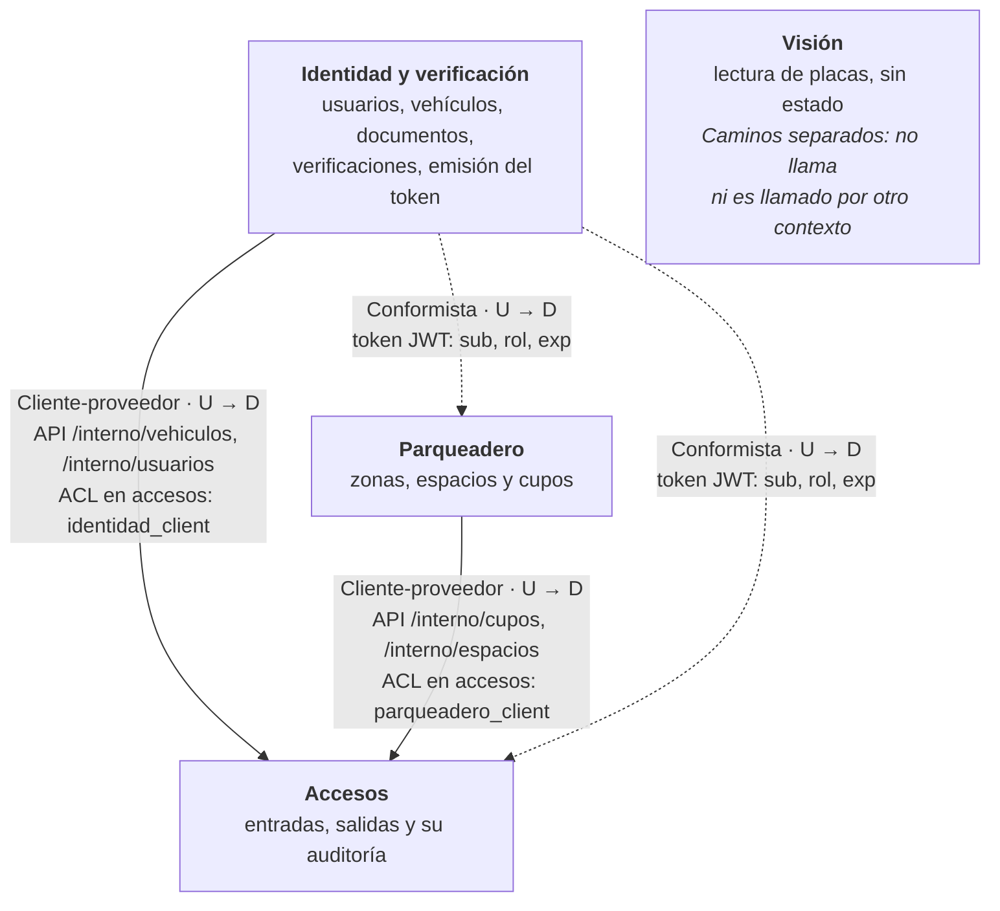

# Mapa de contextos (DDD)

Hay cuatro contextos delimitados, uno por microservicio. Ya no existe un *Shared Kernel*: ningún
contexto comparte tablas ni código con otro, y lo que necesitan lo piden por API. Identidad y
Parqueadero son proveedores (*upstream*, U) de Accesos (*downstream*, D), que traduce sus
respuestas a su propio lenguaje. El token que emite Identidad lo aceptan Accesos y Parqueadero tal
como viene. Visión va por su cuenta.

| Relación | Tipo | Por qué (según el código) |
|---|---|---|
| Identidad → Accesos | Cliente-proveedor, con capa anticorrupción | `/interno` de identidad responde solo lo que accesos necesita (`schemas/interno.py`, sin datos personales); `identidad_client` lo traduce a su propio `VehiculoIdentidad` y a sus propios errores. |
| Parqueadero → Accesos | Cliente-proveedor, con capa anticorrupción | `/interno/cupos` y `/interno/espacios` existen para accesos; `parqueadero_client` traduce el 409 a `CupoNoDisponibleError`. |
| Identidad → Accesos y Parqueadero (token) | Conformista | Ambos aceptan el JWT tal como lo emite identidad (`sub`, `rol`, `exp`, misma `SECRET_KEY`) y repiten su lista de roles, sin traducirlo. |
| Visión | Caminos separados | No llama a ningún servicio ni es llamado por ninguno: la sesión la valida el gateway y la placa leída la lleva el frontend a accesos. |

Verificado contra: `backend-accesos/app/{identidad_client,parqueadero_client}/client.py`,
`backend-identidad/app/api/v1/routers/interno.py`, `backend-parqueadero/app/api/v1/routers/cupos.py`,
`app/core/security.py` y `app/api/deps.py` de accesos y parqueadero, y `backend-vision/app/`.
