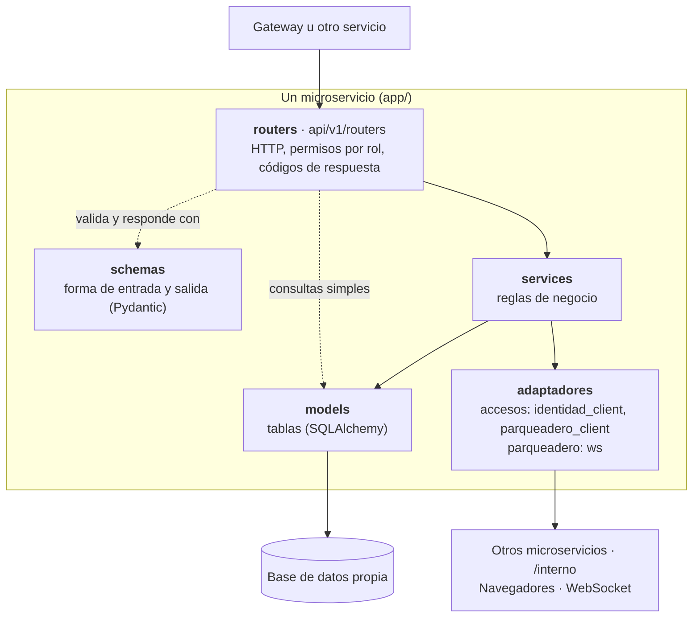

# Capas por servicio

Las capas **no son la arquitectura del sistema**: la arquitectura global son los microservicios
del [diagrama de arquitectura](01-arquitectura.md). Las capas son la forma en que se ordena el
código **dentro** de cada microservicio: los `routers` reciben la petición y revisan permisos, los
`services` aplican las reglas de negocio y los `models` son las tablas de la base propia; los
`schemas` definen qué entra y qué sale. Cada servicio repite esta organización por separado, con
su propio código y su propia base.

| Servicio | ¿Sigue las capas? | Particularidades |
|---|---|---|
| `backend-identidad` | Sí | `services` de verificación, vehículos, documentos y auditoría. |
| `backend-accesos` | Sí | Añade `identidad_client` y `parqueadero_client` para llamar a los otros servicios. |
| `backend-parqueadero` | Sí | Añade `ws` para avisar los cupos por WebSocket. |
| `backend-vision` | No | Es `routers → pipeline` (preprocesar, OCR, posprocesar); no tiene base, `models` ni `services`. |

Las líneas punteadas son atajos que existen en el código: los routers validan y responden con
`schemas`, y hacen directamente las consultas simples (listar, buscar por id) sobre `models`; las
operaciones con reglas de negocio pasan por `services`. El router de accesos también usa
`parqueadero_client` para mostrar el código de cada espacio.

Verificado contra: `app/api/v1/routers/`, `app/services/`, `app/models/` y `app/schemas/` de cada
backend, y `backend-vision/app/{api/routers,pipeline}/`.
