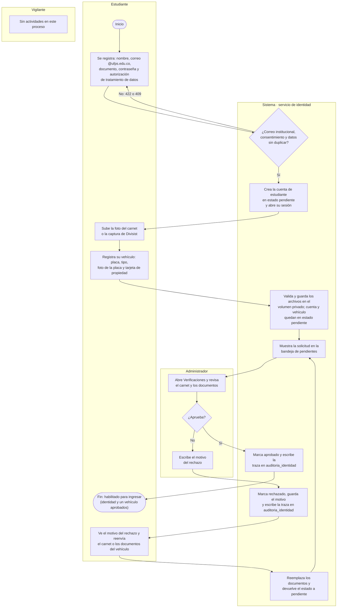

# Proceso: registro y verificación del estudiante

El estudiante se registra solo, con su correo institucional, y elige su contraseña: el
administrador nunca la conoce. Después sube su carnet y registra su vehículo con dos fotos; todo
nace en estado **pendiente**. El administrador revisa los documentos y aprueba o rechaza; si
rechaza, escribe un motivo que el estudiante ve para corregir y reenviar. Cada decisión queda en la
auditoría de identidad. El vigilante no interviene: solo verá el resultado al registrar la entrada.

| Carril | Actividad | Sistema / ruta | Resultado |
|---|---|---|---|
| Estudiante | Se registra | Frontend `/registro` → `POST /api/v1/auth/registro` (identidad) | 201: cuenta de rol estudiante, `pendiente`, con la fecha del consentimiento y solo el hash de la contraseña |
| Sistema | Valida el registro | Identidad | 422 si el correo no es `@ufps.edu.co`, falta el consentimiento o un dato no cumple el tamaño; 409 si el correo o el documento ya existen |
| Sistema | Abre la sesión | Frontend → `POST /api/v1/auth/login` y `GET /api/v1/usuarios/me` | Token de 8 horas; el estudiante cae en «Mi cuenta» |
| Estudiante | Sube el carnet o la captura de Divisist | `POST /api/v1/usuarios/me/carnet` | Cuenta en `pendiente`; reemplaza el carnet anterior. 409 si la identidad ya fue aprobada |
| Estudiante | Registra su vehículo con foto de la placa y tarjeta de propiedad | `POST /api/v1/vehiculos/mis-vehiculos` | 201: vehículo `pendiente`. 422 si la placa no tiene formato de carro (`ABC123`) o moto (`ABC12`, `ABC12D`); 409 si la placa ya existe |
| Sistema | Valida y guarda los archivos | Identidad, volumen `identidad_uploads` | Acepta JPG, PNG, WEBP o PDF (la foto de la placa, solo imagen) hasta 5 MB, comprobando el contenido real; 422 si no cumple |
| Sistema | Muestra la solicitud en la bandeja | `GET /api/v1/verificaciones/pendientes` (solo administrador) | Estudiantes con carnet por revisar o con vehículos pendientes; quien no ha subido nada no aparece |
| Administrador | Revisa el carnet y los documentos | `GET /api/v1/documentos/{id}/archivo` | Solo el administrador y el dueño pueden ver el archivo; para los demás, 404 |
| Administrador | Aprueba | `POST /api/v1/verificaciones/usuarios/{id}/resolver` o `.../vehiculos/{id}/resolver` con `aprobar: true` | Estado `aprobado`. 400 si faltan el carnet o los documentos del vehículo |
| Administrador | Rechaza con motivo | Las mismas rutas con `aprobar: false` y `motivo` | Estado `rechazado` y motivo guardado. 400 si no hay motivo |
| Sistema | Deja la traza de la decisión | Identidad, tabla `auditoria_identidad` | Estado anterior y nuevo, motivo y quién decidió, en la misma transacción |
| Estudiante | Ve el motivo y reenvía | `POST /api/v1/usuarios/me/carnet` o `POST /api/v1/vehiculos/mis-vehiculos/{id}/reenviar` | Documentos reemplazados y estado otra vez `pendiente`. El reenvío del vehículo solo vale si está rechazado (409 si no) |

- La cuenta y cada vehículo se aprueban o rechazan por separado.
- «Habilitado» significa identidad aprobada y al menos un vehículo aprobado; la regla se aplica
  de verdad al registrar la entrada ([proceso 06](06-entrada-y-salida.md)).

Verificado contra: `backend-identidad/app/api/v1/routers/{auth,usuarios,vehiculos,verificaciones,documentos}.py`,
`backend-identidad/app/services/{verificacion_service,documento_service}.py`,
`backend-identidad/app/schemas/usuario.py` y `frontend/src/pages/{auth/Registro,user/EstudiantePanel,admin/AdminDashboard}.tsx`.
