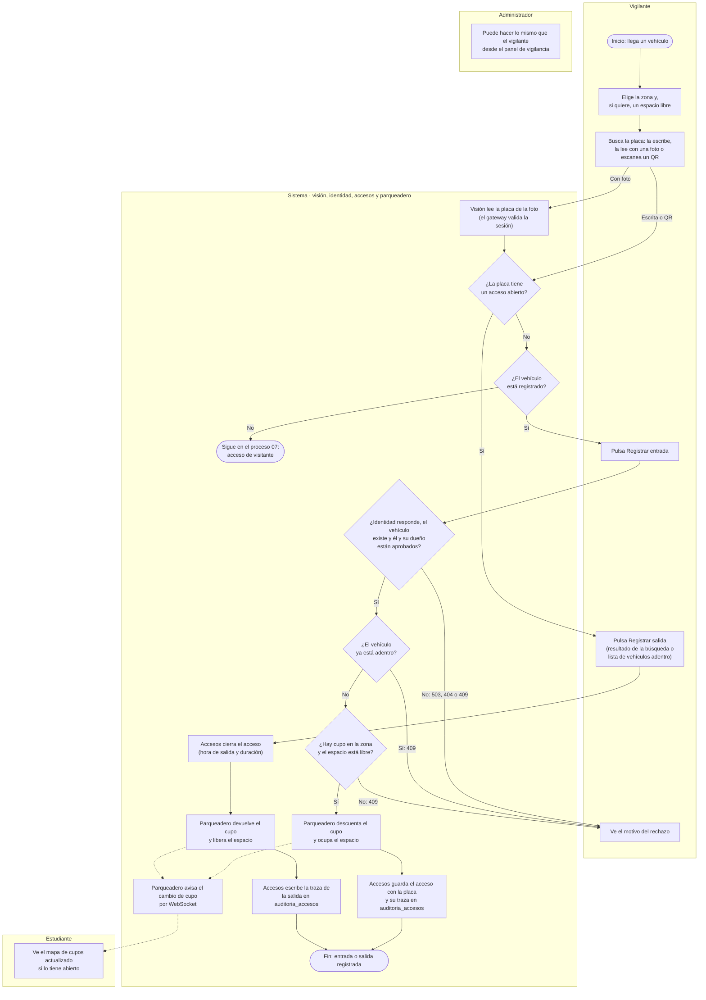

# Proceso: entrada y salida de un vehículo

El vigilante elige la zona y busca la placa: la escribe, la lee con una foto (servicio de visión)
o escanea un QR. Si el vehículo está registrado, registra la entrada. Entonces el sistema hace tres
cosas en orden: Accesos le pregunta a Identidad si el vehículo y su dueño están aprobados, le pide
a Parqueadero que descuente el cupo y, por último, guarda el acceso con su traza de auditoría. Si
algo falla, la entrada se rechaza con un motivo claro. La salida es el camino inverso: se cierra
el acceso y se devuelve el cupo. Cada cambio de cupo se avisa por WebSocket al mapa.

| Carril | Actividad | Sistema / ruta | Resultado |
|---|---|---|---|
| Vigilante | Elige la zona y, si quiere, un espacio libre | `GET /api/v1/zonas`, `GET /api/v1/espacios?zona_id=` (parqueadero) | Ve los cupos de la zona; sin espacio, solo se mueve el contador |
| Vigilante | Lee la placa con una foto | `POST /api/v1/alpr/reconocer` (visión; el gateway valida antes la sesión contra identidad) | Placa y confianza. 400 si la imagen no sirve; 422 si no se detecta una placa |
| Vigilante | Busca la placa (escrita, leída o por QR) | `GET /api/v1/accesos/buscar?placa=` (accesos) y `GET /api/v1/vehiculos/placa/{placa}` (identidad) | Acceso abierto → ofrece la salida; vehículo registrado → ofrece la entrada; no registrado → [proceso 07](07-acceso-de-visitante.md) |
| Vigilante | Registra la entrada | `POST /api/v1/accesos/entrada` con `tipo_acceso: normal` | 201 con el acceso; guarda si la placa la leyó la cámara y con qué confianza |
| Sistema | Consulta el vehículo | Accesos → `GET /interno/vehiculos/{id}` (identidad) | **503** si identidad no responde en 5 s; **404** si el vehículo no existe; **409** si el vehículo o su dueño no están aprobados |
| Sistema | Comprueba que no esté adentro | Accesos, índice único `uq_accesos_vehiculo_activo` | **409** «El vehículo ya tiene un acceso activo» |
| Sistema | Ocupa el cupo (RN-01) | Accesos → `POST /interno/cupos/ocupar` (parqueadero) | Descuento atómico. **409** si la zona no tiene cupos o el espacio no está libre; 503 si parqueadero no responde |
| Sistema | Guarda el acceso y su traza (RN-04) | Accesos, tablas `accesos` y `auditoria_accesos` | Acceso con la placa y traza de creación en una sola transacción; si falla, se libera el cupo (compensación) |
| Vigilante | Registra la salida | `POST /api/v1/accesos/{id}/salida` | 404 si el acceso no existe o ya se cerró |
| Sistema | Cierra el acceso (RN-02) | Accesos | Hora de salida y minutos de permanencia |
| Sistema | Libera el cupo | Accesos → `POST /interno/cupos/liberar` (parqueadero) | Cupo devuelto y espacio libre. Si parqueadero falla (503 o 409), la salida se revierte y el acceso sigue abierto |
| Sistema | Deja la traza de la salida | Accesos, `auditoria_accesos` | Traza de actualización; si falla, se vuelve a ocupar el cupo (compensación) |
| Sistema | Avisa el cambio de cupo | Parqueadero, WebSocket `/ws/zonas` | Evento `zona_actualizada` a todos los mapas abiertos |
| Estudiante | Ve el mapa actualizado | Frontend `/mapa` | Ver [proceso 08](08-cupos-y-auditoria.md) |
| Administrador | Opera el panel de vigilancia | Frontend `/vigilante` (roles vigilante y admin) | Las mismas actividades del vigilante |

- **Si identidad se cae**, toda entrada responde 503; las salidas, la lista de vehículos adentro
  y la búsqueda siguen funcionando porque `accesos` guarda la placa.
- El rechazo llega al vigilante como un mensaje en su pantalla; no se crea ningún acceso.
- Si la compensación del cupo también falla, hoy solo queda un registro en el log.

Verificado contra: `backend-accesos/app/api/v1/routers/accesos.py`,
`backend-accesos/app/services/acceso_service.py`, `backend-accesos/app/{identidad_client,parqueadero_client}/client.py`,
`backend-parqueadero/app/api/v1/routers/cupos.py`, `backend-parqueadero/app/services/zona_service.py`,
`backend-vision/app/api/routers/alpr.py`, `gateway/nginx.conf.template` y `frontend/src/pages/guard/GuardDashboard.tsx`.
