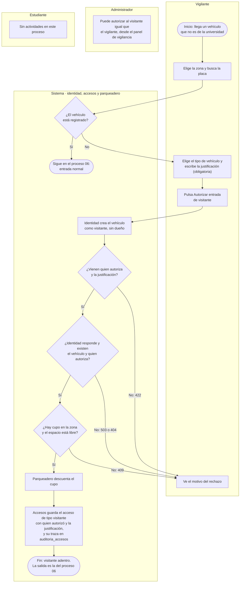

# Proceso: acceso de visitante

Cuando la placa no está registrada, el vehículo es un visitante y no puede entrar por el camino
normal. Según la regla RN-03, alguien debe autorizarlo y dejar escrita la justificación: lo hace
el vigilante (o un administrador) desde el panel de vigilancia. El sistema crea el vehículo como
visitante, sin dueño, y guarda el acceso con quién lo autorizó y por qué. A un visitante no se le
exige verificación de documentos, pero sí que haya cupo. La salida es la misma del proceso 06.

| Carril | Actividad | Sistema / ruta | Resultado |
|---|---|---|---|
| Vigilante | Elige la zona y busca la placa | `GET /api/v1/accesos/buscar?placa=` y `GET /api/v1/vehiculos/placa/{placa}` | 404 en ambas: el panel muestra «Vehículo no registrado — requiere autorización de visitante» |
| Vigilante | Elige el tipo de vehículo y escribe la justificación | Frontend `/vigilante` | El botón no se habilita sin justificación ni cuando la zona no tiene cupos |
| Vigilante | Autoriza la entrada | `POST /api/v1/vehiculos` y luego `POST /api/v1/accesos/entrada` | Dos llamadas seguidas desde el navegador |
| Sistema | Crea el vehículo de visitante | Identidad, `POST /api/v1/vehiculos` con `es_visitante: true` (solo vigilante o admin) | 201: vehículo sin dueño. 409 si la placa ya existe |
| Sistema | Exige autorización y justificación (RN-03) | Accesos: validación del cuerpo y restricción `ck_accesos_visitante_requiere_autorizacion` | **422** si falta `autorizado_por_id` o `justificacion` |
| Sistema | Consulta a identidad | Accesos → `GET /interno/vehiculos/{id}` y `GET /interno/usuarios?id=` | **503** si identidad no responde; **404** si no existen el vehículo o quien autoriza. No se exige que estén verificados |
| Sistema | Ocupa el cupo (RN-01) | Accesos → `POST /interno/cupos/ocupar` (parqueadero) | **409** si no hay cupos o el espacio no está libre |
| Sistema | Guarda el acceso y su traza | Accesos, `accesos` y `auditoria_accesos` | Acceso de tipo `visitante` con `autorizado_por_id` y `justificacion`; la traza registra el tipo de acceso |
| Administrador | Autoriza a un visitante | Frontend `/vigilante` (roles vigilante y admin) | Las mismas actividades del vigilante; queda él como quien autoriza |
| Estudiante | — | — | No participa |

- Quien autoriza es siempre el usuario con sesión en el panel: el frontend envía su identificador.
- **Límite actual:** el vehículo de visitante queda registrado. Si vuelve, la búsqueda lo encuentra
  y entra por el [proceso 06](06-entrada-y-salida.md) como acceso normal, sin autorización ni
  justificación. Tampoco se comprueba que quien autoriza sea vigilante o administrador. Ambos puntos
  están anotados en [`pendientes.md`](../pendientes.md).

Verificado contra: `frontend/src/pages/guard/GuardDashboard.tsx`,
`backend-identidad/app/api/v1/routers/{vehiculos,interno}.py`, `backend-identidad/app/models/vehiculo.py`,
`backend-accesos/app/schemas/acceso.py`, `backend-accesos/app/services/acceso_service.py`,
`backend-accesos/alembic/versions/0001_estructura_inicial.py` y `docs/reglas-de-negocio.md` (RN-03).
