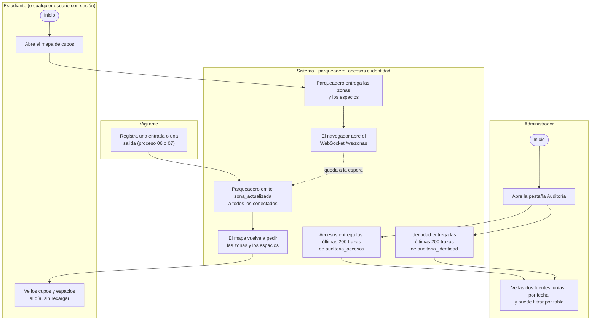

# Proceso: consulta de cupos en tiempo real y auditoría

Son dos consultas, ninguna cambia datos. Cualquier usuario con sesión abre el mapa y ve los cupos
de cada zona; el navegador se queda conectado por WebSocket y, cada vez que el vigilante registra
una entrada o una salida, Parqueadero avisa y el mapa se actualiza solo, sin recargar la página.
Por su parte, el administrador abre la auditoría y ve en una sola lista lo que guardan dos
servicios distintos: las trazas de accesos y las de verificaciones.

| Carril | Actividad | Sistema / ruta | Resultado |
|---|---|---|---|
| Estudiante (o cualquier usuario) | Abre el mapa de cupos | Frontend `/mapa` → `GET /api/v1/zonas` y `GET /api/v1/espacios?zona_id=` (parqueadero) | Zonas activas con `cupos_disponibles/capacidad_total` y el estado de cada espacio; basta una sesión válida, sin importar el rol |
| Sistema | Abre el canal en tiempo real | Navegador → gateway `/ws/*` → parqueadero `/ws/zonas` | Conexión abierta; si se cae, el navegador reintenta con esperas de 1 a 10 s |
| Vigilante | Registra una entrada o una salida | Procesos [06](06-entrada-y-salida.md) y [07](07-acceso-de-visitante.md) | Parqueadero mueve el cupo |
| Sistema | Avisa el cambio | Parqueadero, tras `POST /interno/cupos/ocupar` o `liberar` | Evento `zona_actualizada` con la zona y sus cupos, a todos los conectados |
| Sistema | Refresca el mapa | Frontend: vuelve a pedir zonas y espacios | El usuario ve los cupos al día |
| Vigilante | Ve los cupos en su panel | Frontend `/vigilante` → `GET /api/v1/zonas` | Se recargan después de cada operación suya (no usa el WebSocket) |
| Administrador | Abre la pestaña Auditoría | Frontend `/admin` → `GET /api/v1/auditoria` (accesos) y `GET /api/v1/verificaciones/auditoria` (identidad) | Solo administrador; las últimas 200 trazas de cada servicio |
| Administrador | Revisa y filtra | Parámetro `tabla_afectada` en ambas rutas | Una sola lista ordenada por fecha, con el origen de cada traza; si un servicio falla, se muestra el otro con un aviso |

- La auditoría es de solo lectura: no hay rutas para modificarla y las tablas `auditoria_accesos`
  y `auditoria_identidad` solo admiten inserción (RN-04).
- **Límites actuales**, anotados en [`pendientes.md`](../pendientes.md): `/ws/zonas` no valida la
  sesión, y el filtro ofrece «espacios» y «zonas», tablas de las que ningún servicio escribe trazas.

Verificado contra: `frontend/src/pages/user/ParkingMapPage.tsx`,
`frontend/src/services/realtime/useActualizacionesZona.ts`, `frontend/src/pages/admin/AdminDashboard.tsx`,
`backend-parqueadero/app/api/v1/routers/{zonas,espacios,realtime,cupos}.py`,
`backend-accesos/app/api/v1/routers/auditoria.py` y `backend-identidad/app/api/v1/routers/verificaciones.py`.
